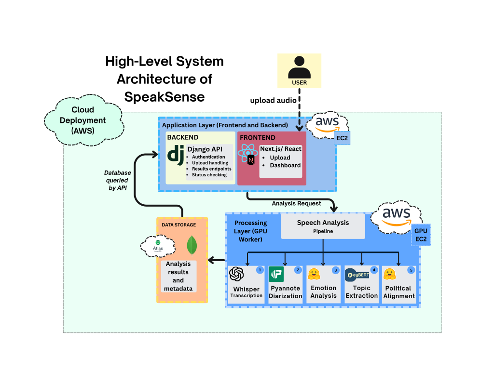
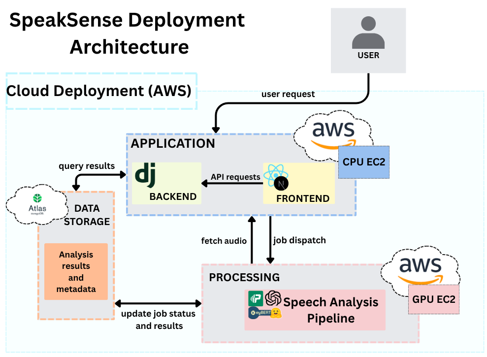
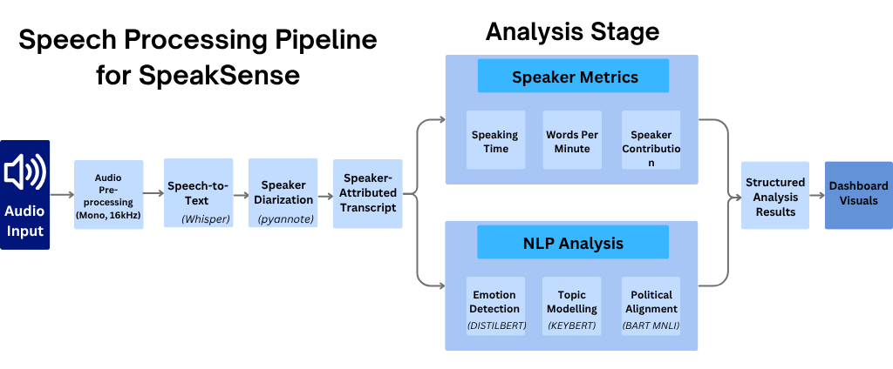
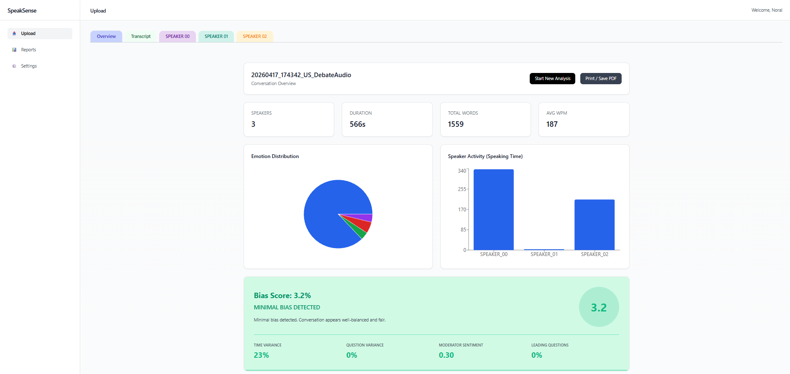

# SpeakSense – Multi-Speaker Audio Analysis Platform

SpeakSense is an AI-powered system designed to analyse multi-speaker conversational audio and transform it into structured, interpretable insights.

The platform processes raw audio inputs such as debates, interviews, and discussions, automatically extracting transcription, speaker identities, emotional tone, topics, and conversational behaviour metrics.

All outputs are presented through an interactive dashboard, enabling users to explore and understand complex conversations in a clear and meaningful way.

## Demo Video

This video demonstrates the full SpeakSense system, including architecture, code walkthrough, and live analysis.

[](https://youtu.be/vguLzReSgsM)

## Tech Stack

| Layer                 | Technology                        | Purpose |
|----------------------|----------------------------------|--------|
| Frontend             | Next.js / React                  | Interactive dashboard and user interface |
| Backend API          | Django REST Framework            | Core API, authentication, and job orchestration |
| ML Worker            | FastAPI                          | Handles ML processing and pipeline execution |
| Transcription        | OpenAI Whisper                   | Converts speech to text |
| Diarization          | pyannote.audio                   | Identifies and segments speakers |
| Emotion Analysis     | DistilBERT                       | Classifies emotional tone from text |
| Topic Extraction     | KeyBERT                          | Extracts key topics and keywords |
| Political Analysis   | BART-MNLI (zero-shot)            | Infers political stance using zero-shot classification |
| Database             | MongoDB Atlas                    | Stores analysis results and metadata |
| Cloud Infrastructure| AWS EC2 (CPU + GPU instances)    | Hosts backend and GPU processing environments |
| Containerisation     | Docker                           | Ensures consistent deployment across environments |

## Getting Started

### Prerequisites

Make sure you have the following installed:

- Python 3.10+
- Node.js (v18+)
- npm or yarn
- MongoDB (local or MongoDB Atlas)
- Git

Optional (recommended for full performance):
- NVIDIA GPU with CUDA support
- Docker & Docker Compose

---

### 1. Clone the Repository

```bash
git clone https://github.com/norakeavney/SpeakSense.git
cd SpeakSense
```

### 2. Backend Setup (Django API)

```bash
cd backend
pip install -r requirements.txt
```

Create a .env file in the backend directory:

```bash
MONGO_URI=your_mongodb_connection_string
GPU_WORKER_URL=http://localhost:8001
```

2. Run the backend server:

```bash
python manage.py runserver
```

Backend will run on:
http://localhost:8000

### 3. Frontend Setup (Next.js)

```bash
cd frontend
npm install
npm run dev
```

Frontend will run on: http://localhost:3000

### 4. GPU Worker Setup (FastAPI + ML Pipeline)

```bash
cd speechlab
pip install -r requirements.txt
```

Create a .env file in the speechlab directory:

```bash
BACKEND_URL=http://localhost:8000
HF_TOKEN=your_huggingface_token
```

Run the GPU worker:

```bash
uvicorn main:app --host 0.0.0.0 --port 8001
```

GPU worker runs on: http://localhost:8001

### 5. Running the Full System

Start all components in this order:

- Backend (Django)
- GPU Worker (FastAPI)
- Frontend (Next.js)

Then:

- Open http://localhost:3000
- Upload an audio file or provide a YouTube link
- Wait for processing to complete
- View results in the dashboard

### 6. (Optional) Run with Docker

If Docker is configured:

```bash
docker-compose up --build
```

This will start:

- Backend
- Frontend
- GPU Worker

Notes
- First run may take time due to model downloads (Whisper, pyannote, etc.)
- GPU is strongly recommended for faster processing
- Ensure environment variables are correctly set before running

## Features

- Automatic Speech Recognition (ASR) using OpenAI Whisper  
- Speaker Diarization (multi-speaker identification)  
- Speaker Metrics (speaking time, word count, speaking rate)  
- Emotion Analysis (text-based and audio-based)  
- Topic Extraction using KeyBERT  
- Political Alignment Analysis (zero-shot classification)  
- Interactive Dashboard with visualisations  
- Support for real-world audio (uploaded files or YouTube links (locally))


## System Architecture

SpeakSense follows a distributed architecture consisting of a frontend, backend API, GPU processing worker, and database.

### High-Level Architecture



### Deployment Architecture (AWS)



## Speech Processing Pipeline

The system processes raw audio through a multi-stage pipeline:

1. Audio preprocessing  
2. Speech-to-text transcription (Whisper)  
3. Speaker diarization (pyannote)  
4. Speaker-attributed transcript generation  
5. Feature extraction and analysis:
   - Speaker metrics
   - Emotion detection
   - Topic modelling
   - Political alignment  
6. Structured analytical output generation  

### Pipeline Overview



## Backend Job Processing Flow

The system uses an asynchronous job-based architecture:

1. User uploads audio  
2. Backend creates an analysis job  
3. Job is dispatched to GPU worker  
4. Worker downloads audio and processes pipeline  
5. Results are stored and returned  
6. Frontend polls for status updates  


## Data Storage Structure

SpeakSense uses MongoDB to store audio metadata and analysis results.

- **Audio Files Collection** – stores uploaded audio references  
- **Analysis Jobs Collection** – tracks processing status and results

## CI/CD

A lightweight CI/CD pipeline is configured using GitHub Actions. When triggered, the workflow connects to the backend and GPU worker EC2 instances via SSH, pulls the latest code, and rebuilds the application using Docker.

A few things worth noting:

- The AWS instances are started and stopped manually to manage cost — the pipeline assumes they are already running when triggered
- The GPU instance in particular is kept off by default and started on-demand before running an analysis
- Environment variables and credentials are managed via GitHub Secrets

## Dashboard & Outputs

Results are presented through an interactive dashboard, providing both high-level summaries and detailed insights.

### Example Dashboard



### Key Outputs

- Speaker distribution and speaking time  
- Emotion distribution and timeline  
- Topic summaries  
- Bias and conversational balance metrics  
- Word counts and speaking pace  

## Evaluation

SpeakSense was tested on real-world conversational audio including debate excerpts and interviews. The system successfully generates speaker-attributed transcripts and extracts meaningful insights such as speaking time, emotional tone, and topic distributions.

Performance varies by component. Transcription using Whisper (large) produced coherent results across most inputs, though accuracy drops with overlapping speech. Speaker diarization achieved an approximate DER of 18–22% on a manually annotated sample, with higher error rates in segments containing simultaneous speech or rapid speaker transitions. 
Downstream tasks such as emotion detection and topic extraction are functional but dependent on transcription and diarization quality — errors in early stages propagate through the pipeline.

Political alignment classification uses a zero-shot approach and should be treated as indicative rather than definitive.

Full evaluation details, including pipeline comparisons and component-level analysis, are available in the dissertation.

## Future Work

- Improve diarization accuracy for overlapping speech  
- Real-time streaming analysis  
- Enhanced emotion detection using multimodal fusion  
- Expanded political and bias analysis models  
- Mobile and production deployment

## Use of AI Tools

AI tools were used in a limited and supportive capacity during the development of this project.
Tools such as ChatGPT, Claude and GitHub Copilot were used to assist with:

- **Docker configuration** — helping debug container setup and GPU access within Docker, particularly around CUDA dependencies and environment configuration
- **CI/CD pipeline** — assisting with GitHub Actions workflow syntax and SSH deployment steps to AWS EC2
- **Dashboard UI** — suggesting component structure and layout approaches for the Next.js frontend visualisations
- **General debugging** and understanding of unfamiliar technical concepts across the stack

AI-generated suggestions were always reviewed, tested, and validated before being used. Final decisions regarding system design, model selection, pipeline structure, and evaluation approach were made by the author, with AI tools used as a sounding board and productivity aid throughout the process.

AI tools were used to supplement productivity in areas like configuration and UI, not to replace original work.

## License

This project is developed as part of a Final Year Project (FYP) in Software Development.
